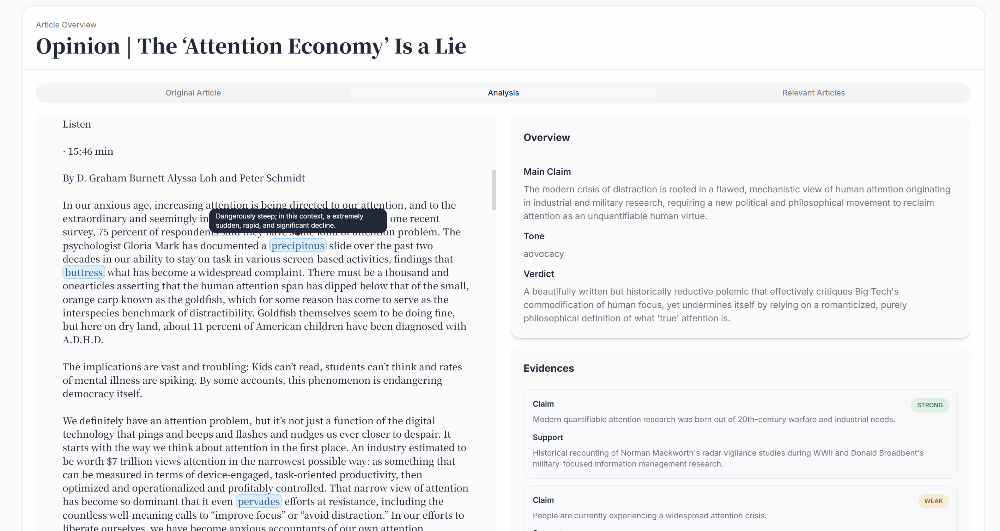
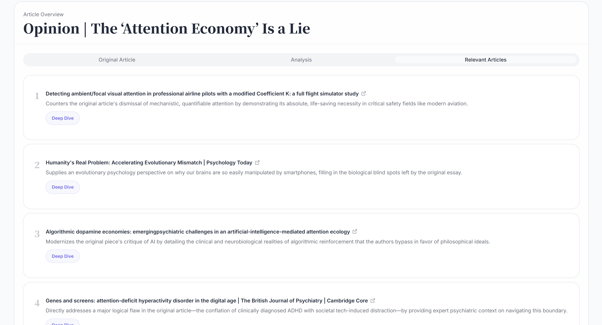
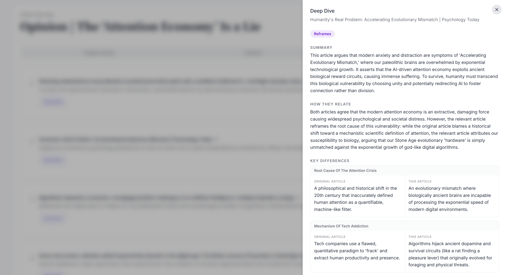

# Article Prism
Article Prism is an app that helps you fully understand any article with detailed analysis, key vocabularies and its meanings, and a comparison with relevant articles. I built this app because in my English class, I found that reading relevant articles help understand an article and the context deeply. This app does that automatically for you, and it guides you to have balanced perspectives.  
[View Demo](https://article-prism.vercel.app)

## Screenshots

<em>Analysis</em>

 

<em>Relevant Articles</em>

 

<em>Deep Dive</em>

 

Try it out yourself with [this article](https://www.nytimes.com/2026/01/10/opinion/attention-world-war-2-technology-nazis.html?unlocked_article_code=1.nVA.fXjf.60Knp5bM51Ie&smid=url-share)!

## Tech Stack
- Next.js 16
- Typescript
- Tailwind CSS, shadcn/ui
- Gemini API
- Jina Reader API
- exa-js
- react-markdown

## How it works
1. Paste in an Article URL
2. The app fetches the article's content and analyzes it
3. Get a detailed analysis including main claim, evidences, assumptions, logical structure, framing, rhetorical moves, etc.
4. Understand it better with vocabulary help
5. View relevant articles and their explanations, with a deep dive feature offering key differences, shared ground, unique contribution, etc.

## AI use
Github Copilot and Claude was partly used in the making of this app. I used it for app design help - writing boilerplate UI code like component structure and layouts and asking for design advices, as well as fixing bugs whenever I can't figure it out by myself.